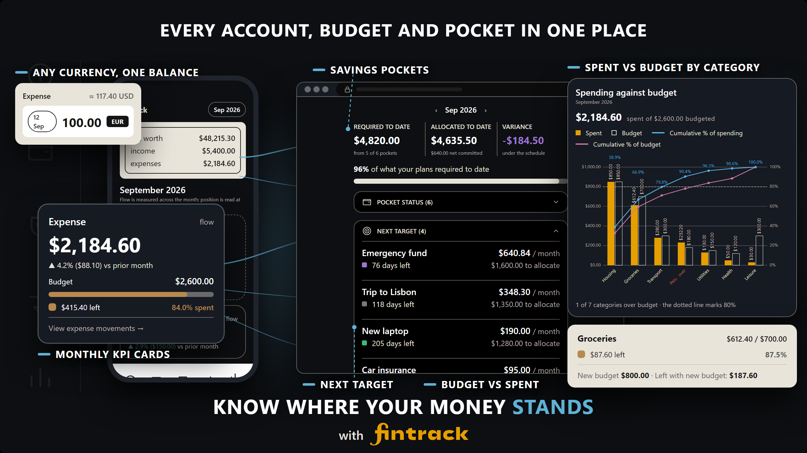

# fintrack 💻


[](https://pern-fintrack.vercel.app)

> A web application for tracking personal finances, managing budgets and savings pockets effectively.


## At a glance

Accounts, budgets and savings pockets in one place. An expense typed in another
currency is converted to your accounting currency at that day's rate; Overview
reads the month in KPI cards and in a Pareto of spending against budget by
category; the pocket board ranks the pockets that still need money each month.
The image is a composition built from the app's own screens.



## Demo

A mobile walkthrough of fintrack's core loop: signing up, creating an
account, recording an expense in a foreign currency at its historical rate,
committing money to a savings pocket, tracking a debt, and exporting a PDF report —
every figure shown is computed live by the app, not staged. The deployed app is
at [pern-fintrack.vercel.app](https://pern-fintrack.vercel.app); sign up to try it.

<video src="https://github.com/user-attachments/assets/cf406ed6-081e-44f6-94b3-cfa1bd7fc839" controls width="480"></video>

## Credits

| Contributor | Role | Contribution |
|---|---|---|
| CDDS | Requirements & Solution Design | Client requirements; conceptual design of the system and of the interactions between features |
| PM | UI/UX Design | High-fidelity Figma designs of the product's initial views |
| CADR | Full-Stack Development | Frontend, backend and database |

## Objective

**fintrack** is a personal "accounting" application, built as a "double-entry accounting system" but under a "cash-flow approach", offering a comprehensive and intuitive solution for managing your money.

Its primary goal is to provide users with effective tools to track expenses, incomes, investments, debts and bank accounts; keeping records of the interactions among the different accounts and keeping all balances updated and reconciled.

fintrack also helps users track investments and plan their savings with **pockets**: a target amount and a desired date, backed by money that stays in the user's bank accounts.

**A WORD FOR DEVELOPERS** 
Throughout the development of this app, various alternative approaches were intentionally employed for similar tasks for the sake of gradually learning; it functioned as a sandbox.

The codebase does not follow a single uniform standard because it focuses on exploring different approaches rather than adhering to one fixed pattern.

The methods applied, ranged from customized native implementations to the use of common libraries to perform the same functions, specifically for form validations.

This project is an exploration of different methods used to identify practices that will be used in defining a standard for future projects.

### APP DESCRIPTION

### Double-Entry Accounting Approach
The double-entry system is a method of recording financial transactions where every entry to an account requires a corresponding and opposite entry to a different account. 

As a double-entry accounting system, it automatically reflects the updated balances of all related accounts as soon as a transaction is recorded, ensuring that your financial overview is always accurate and up to date.

#### Core Mechanism
*   **Duality:** Every transaction involves at least two accounts: a **Debit (Dr)** and a **Credit (Cr)**.
*   **Accounting Equation:** The system is governed by the formula: `Assets = Liabilities + Equity`.
*   **Balance Requirement:** The total sum of debits must equal the total sum of credits for every transaction, ensuring the ledger remains in equilibrium.

### Cash-Flow Approach

This system utilizes arithmetic logic to record the movement of funds:

*   **Minus Sign (–):** Identifies withdrawals or outflows from an account.
*   **Plus Sign (+):** Identifies deposits or inflows into an account.

#### Mechanism
The system records transfers by performing a simultaneous subtraction from the source and an addition to the destination. This tracks the path of funds between accounts for auditing purposes.

#### Transfer Example: Main Bank to Second Bank ($500)

| Account | Operation | Sign | Amount | Impact |
| :--- | :--- | :---: | :--- | :--- |
| **Main Bank** | Withdrawal | **–** | $500 | Outflow from source |
| **Second Bank** | Deposit | **+** | $500 | Inflow to destination |

A savings pocket never takes part in a transfer: it is not an account and holds no money (see Savings Pockets below).

### Integration of Dual Accounting Methodologies

The system implements a hybrid architecture that integrates both **Standard Double-Entry Accounting** and an intuitive **Cash-Flow Approach**. The distinction between these methods is defined by the logic used to record fund directionality.

#### Divergence in Account Interactions

The primary difference between the two integrated layers lies in how transaction signs are assigned:

1.  **Standard Accounting Layer (Classification-Dependent):**
    Entries are recorded as Debits (Dr) or Credits (Cr) based on the account classification (Assets, Liabilities, Equity). In this layer, a mathematical sign's meaning fluctuates according to the account type.

2.  **Cash-Flow Layer (Direction-Dependent):**
    Unlike standard classification-based rules, this layer assigns signs based exclusively on the movement of funds. The sign is determined by whether the money enters or exits the account:
    *   **Minus Sign (–):** Applied to all **Withdrawals** or outflows, regardless of account classification.
    *   **Plus Sign (+):** Applied to all **Deposits** or inflows, regardless of account classification.

#### Comparative Logic of the coexistence of these two approaches

| Feature | Standard Accounting Logic | Cash-Flow Logic (Integrated) |
| :--- | :--- | :--- |
| **Logic Basis** | Account Classification (Asset/Liability) | Movement Direction (Inflow/Outflow) |
| **Sign Assignment** | Variable (Type-dependent) | Constant (Direction-dependent) |
| **User Guidance** | Internal Ledger Integrity | Intuitive Transaction Tracking |

#### Implementation Mechanism
This dual approach allows the system to maintain professional-grade ledger books while guiding the user through an intuitive interface. When a transaction occurs, the system simultaneously records the classification-specific Withdrawal/Deposit for the accounting books and the direction-specific Plus/Minus sign for the user’s cash-flow tracking.

### Account Classes: Positions and Flows

A figure is either a position or a flow, the accounting distinction between stocks and flows:

| Class | What it measures | Question it answers | fintrack types |
| :--- | :--- | :--- | :--- |
| **Position** (real / permanent accounts: assets and liabilities) | What you hold or owe at a date | "How much do I have or owe?" | `bank`, `cash`, `investment`, `debtor` |
| **Flow** (nominal / temporary accounts: income, expenses, gains and losses) | What came in or went out over a period | "How much came in or went out for this concept?" | `income_source`, `category_budget` |

Every movement joins both classes: a $1,000 salary is `bank` +1,000 and `income_source` −1,000; a $50 grocery payment is `bank` −50 and `category_budget` +50.

- **Net worth** adds positions only (assets less liabilities); a flow has already changed the positions it touched, so adding it would count the same money twice.
- **An income source reads negative** because it is the source (credit) leg of every income, not because it is a debt.
- **Flow accounts are never closed per period**: unlike formal bookkeeping, their balance accumulates since opening. Overview reads a flow for the month and a position at its close.
- **Every position also has a flow**: its change over the period, such as the month's net cash flow.
- **A pocket commitment is a position, but not of money**: it earmarks part of the bank balances without moving it, so net worth does not add it again.
- **PnL is a flow** read by movement type, not an account type.

## Key Features

The modules are listed in the order of the app's navigation bar, from left to right.

1. **Tracker**:

   - Detailed tracking of expenses and income, by category and date; an expense in another currency is converted at that day's rate.
   - Record and manage multiple income sources, with a clear view of their contribution to overall balances.
   - Transfers between accounts, and PnL (profit and loss) adjustments on bank and investment accounts.

2. **Budget**:

   - An expense account can be given a monthly budget when it is created.
   - The budget is edited from the Budget board, for the month on screen: **this month** only, **until** a chosen month (up to 12 months ahead), or **every month** from then on. A budget can also be stopped from a month onwards.
   - Each month shows the budget, what was spent, what remains and the percentage executed; nothing carries over from one month to the next.
   - A variance screen ranks categories, and their subcategories, by the gap between budget and spending.

   The design and the calculation are in
   [docs/budget/BUDGET_MODULE_TECHNICAL_GUIDE.md](docs/budget/BUDGET_MODULE_TECHNICAL_GUIDE.md).

3. **Savings Pockets**:

   - A pocket is a savings plan, not an account: a target amount and a desired date in the future.
   - Money is **committed** to a pocket from bank accounts and **released** back; nothing moves, the money stays in the bank account and its balance is unchanged.
   - Each commit or release is recorded, with its date, as a new entry; past entries are never edited or deleted.
   - The pocket board shows what is allocated against what the plans require to date, a status level per pocket (ahead, on track, behind, at risk, overdue, completed, above target), and **Next target**: the pockets that still need money, ranked by what they require per month.
   - A pocket is flagged **uncovered** when its funding accounts no longer hold what was committed to it.

   The full transfer matrix and account-initialization rules are in
   [docs/accounts/BUSINESS_RULES.md](docs/accounts/BUSINESS_RULES.md). The
   internal clearing account behind account openings and PnL is described in
   [docs/accounts/SLACK_ACCOUNT.md](docs/accounts/SLACK_ACCOUNT.md).

4. **Debts**:

   - Debts are recorded and classified as debtors or lenders.

5. **Overview**:

   - KPI cards and a Pareto of spending against budget by category for the month.
   - Updated balances for all your accounts (bank, cash, investment, debtor) and a comparison of income and expenses.

6. **Account Closure** (opened from an account in Overview):
   - Closing an account removes it but keeps its identity and history; it settles nothing and transfers nothing on the user's behalf.
   - Bank, cash, investment and debtor accounts must be at zero to close: the user moves the balance out, or chooses **reverse the balance and close**. Income source and category budget accounts close at any balance.
   - A close releases the pockets the account was backing, stops its budget from the current month and records a mandatory close reason, all in one database transaction.
   - Past transactions, pocket entries and budget months still resolve after the close, and other accounts' balances are never rewritten.
   - Five deletion methods were evaluated before this one; see [Account deletion](docs/accounts/ACCOUNT_DELETION.md).

## System Requirements

- Node.js 22.x (the backend declares it in `engines`)
- PostgreSQL
- npm

## Project Structure

fintrack is a PERN application with two independent packages, each with its own `package.json`:

- `frontend/`: React + TypeScript single-page app, built with Vite.
- `backend/`: Node.js + Express API over PostgreSQL, also deployable as Vercel serverless functions.

## Installation

1. Clone this repository and enter it:

   ```bash
   git clone https://github.com/dimatteoCarlos/fintrack-v1.git
   cd fintrack-v1
   ```

2. Install the dependencies of each package:

   ```bash
   cd backend && npm install
   cd ../frontend && npm install
   ```

3. Configure the environment. Copy `backend/.env.example` to `backend/.env` and `frontend/.env.example` to `frontend/.env.local`, then fill in the values. Each example file documents its variables; never commit a real credential.

4. Create the database schema and its base data from `backend/`:

   ```bash
   npm run db:migrate
   npm run db:seed:base
   ```

   The full database lifecycle (creation, reset, seeds, admin user) is described in [the database guide](docs/database/DATABASE_GUIDE.md).

5. Start both servers, each in its own terminal:

   ```bash
   cd backend && npm run dev
   cd frontend && npm run dev
   ```

## Available Scripts

Frontend (`frontend/`):

- `npm run dev`: Starts the Vite development server.
- `npm run build`: Builds the production version.
- `npm run typecheck`: Type-checks the app without emitting files.
- `npm run lint`: Runs the linter to ensure clean code.
- `npm run preview`: Previews the built application.

Backend (`backend/`):

- `npm run dev`: Starts the API with nodemon.
- `npm start`: Starts the API.
- `npm test`: Runs the test suite.
- `npm run db:migrate`: Applies the SQL migrations.
- `npm run db:seed:base` / `npm run db:seed:admin`: Loads the base catalogs / the admin user.

## Technologies Used

Frontend:

- **React**: To build the user interface.
- **TypeScript**: To ensure robust and typed code.
- **Vite**: As an ultra-fast bundler and development server. SVG icons are imported as
  components through `vite-plugin-svgr`; see
  [docs/frontend/SVG_ICON_GUIDE.md](docs/frontend/SVG_ICON_GUIDE.md).
- **React Router**: To handle navigation.
- **Zustand**: For global state.
- **Zod**: For schema validation in some of the forms.
- **React Select and Datepicker**: To enhance the user experience with interactive components.
- **React Toastify**: For notifications.

Backend:

- **Node.js and Express**: The REST API.
- **PostgreSQL** through **pg**: The ledger, accounts, budgets and pockets.
- **JSON Web Tokens and bcrypt**: Authentication.
- **Zod**: Request validation.
- **decimal.js**: Exact decimal arithmetic for amounts.
- **PDFKit and ExcelJS**: Period statement exports.
- **serverless-http**: Deployment as Vercel serverless functions.

Authentication is described in [the auth guide](docs/auth/AUTH_GUIDE.md).

## Feedback and support

This repository is a published snapshot of a codebase developed elsewhere, so pull requests are not merged here. Bug reports and suggestions are welcome on the [issues page](../../issues).

If you find this project helpful, please consider leaving a ⭐ to support it!

Made with 💜 by **CADR**

---

## License

This project is licensed under the terms of the [MIT License](LICENSE).

---

**fintrack**: Your intelligent ally for taking control of your personal finances. 💡💼📊

---

## Case studies

- [Form architecture](docs/forms/FORM_ARCHITECTURE.md) — the tracker forms built five different ways on purpose, and which approach to keep.
- [Development approaches](docs/architecture/DEVELOPMENT_APPROACHES.md) — the same comparison at the level of technique (manual state vs. Zod vs. generic), plus how account details are viewed and edited.
- [Account deletion](docs/accounts/ACCOUNT_DELETION.md) — the five methods evaluated (soft, hard, hard atomic, RTA, RTA with history retention) and how the shipped closure method actually works.
