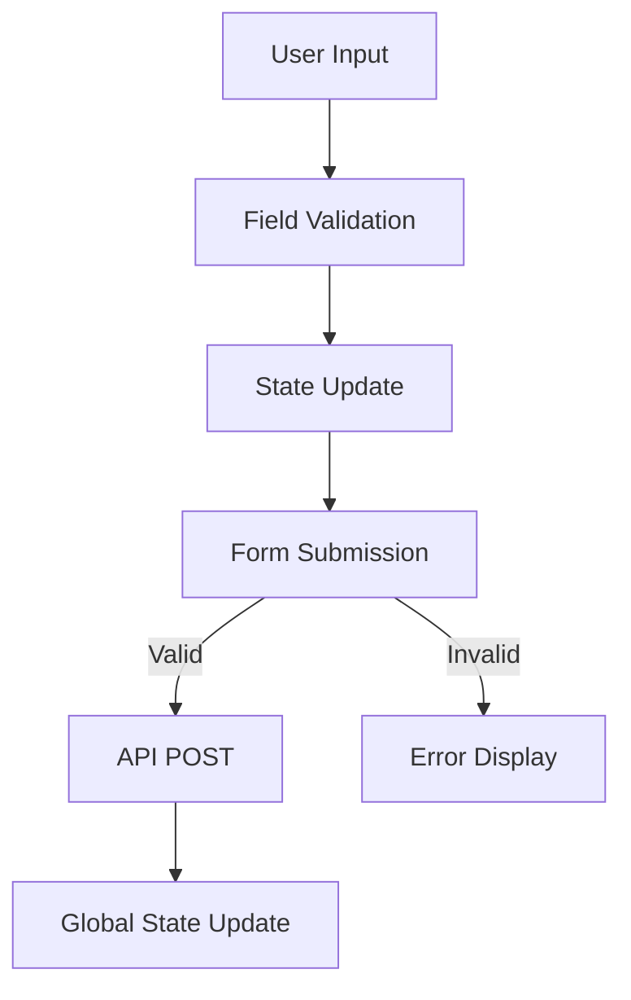
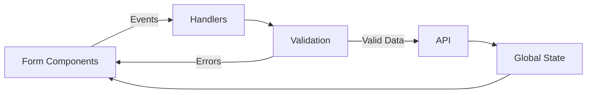
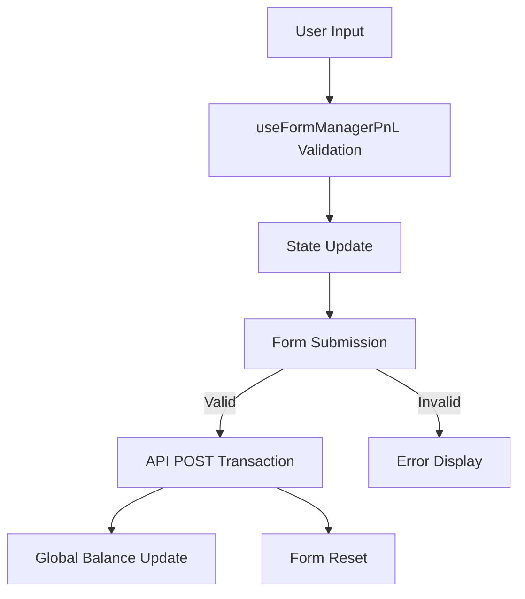
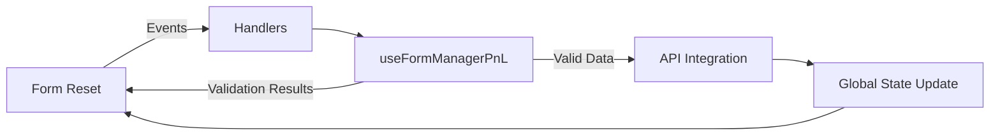
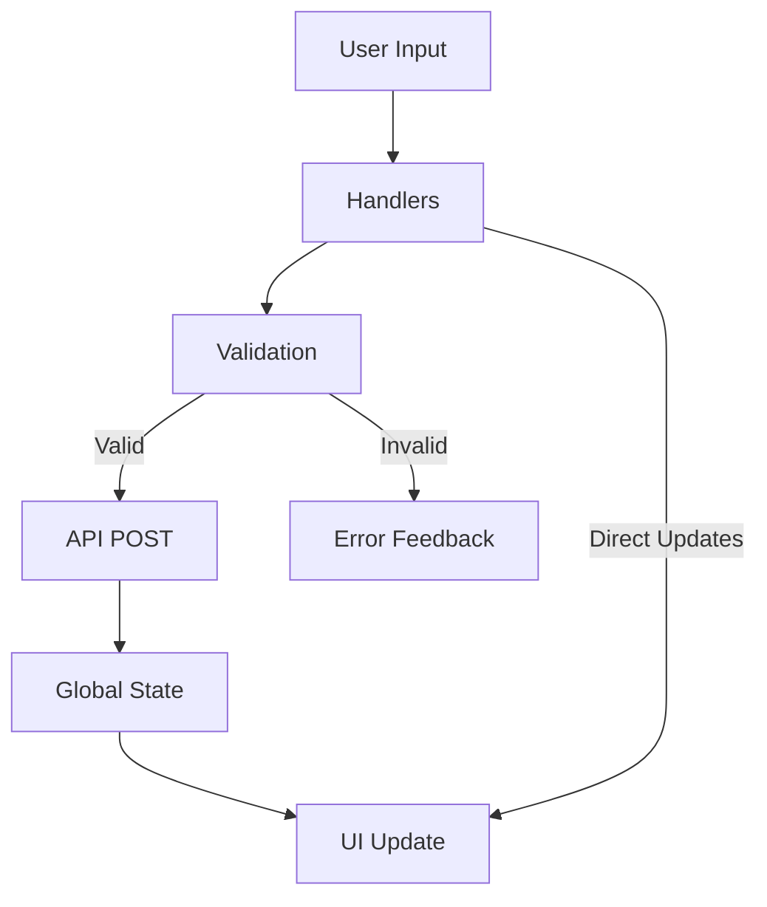
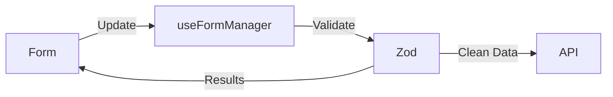
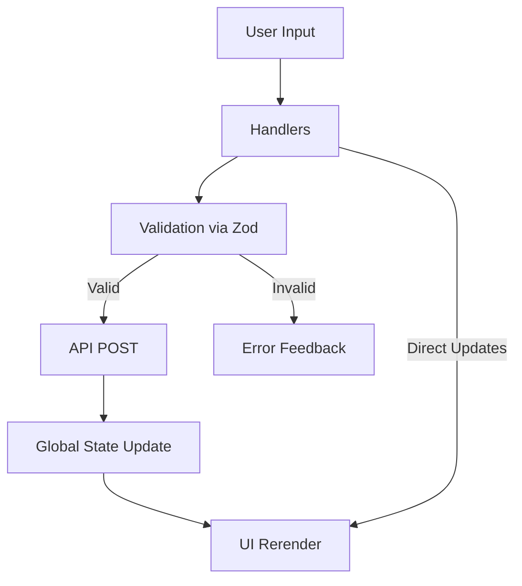

# fintrack Form Architecture

A case study of the application's forms, built with different techniques on
purpose — see **"A WORD FOR DEVELOPERS"** in the root `README.md` for why.

fintrack has 17 forms, developed with different alternative methods:

- **Movement tracker (5):** `Expense.tsx`, `Income.tsx`, `Transfer.tsx`, `PnL.tsx`, `Debts.tsx`.
- **Creation (4):** `NewAccount.tsx`, `NewCategory.tsx`, `NewPocket.tsx`, `NewProfile.tsx`.
- **Edition and closure (3):** `EditAccount.tsx`, `EditPocket.tsx`, `AccountDeletionPage.tsx`.
- **Modal forms (2):** `PocketAllocationModal.tsx` (commit and release money on a pocket), `BudgetEditModal.tsx` (the budget amount for a month and how far forward it applies).
- **Authentication and profile (3):** `AuthUI.tsx` (sign in and sign up), `ChangePasswordForm.tsx`, `UpdateProfileForm.tsx`.

The movement tracker forms are described as follows:

## Debts.tsx
 IMPLEMENTATION CUSTOMIZED WITH NO THIRD PARTY LIBRARIES.

### Core Implementation

#### Key Structural Blocks
1. **State Management**  
   - Local state for form data (`datatrack`, `formData`)  
   - Validation state (`validationMessages`, `showValidation`)  
   - Global balance state (Zustand)  

2. **Data Flow**  
   - Custom hooks for API calls (`useFetch`, `useFetchLoad`)  
   - Manual validation pipeline (no external validation libraries)  
   - Side effects for validation coordination  

3. **UI Components**  
   - `TopCard`: Amount input + debtor selection  
   - `DropDownSelection`: Account picker  
   - `CardNoteSave`: Note field + submit button  

#### Validation Approach
- **Custom validation functions**:  
  `validateAmount`, `checkNumberFormatValue`, `validationData`  
- **Two-phase validation**:  
  1. Field-level during input  
  2. Full-form on submission  

#### Key Data Flows



### Technical Notes
- **No external validation libraries** used - all validation logic is custom  
- State updates trigger dependent validations through `useEffect`  
- Form reset logic handles both UI and data states  

### Component Relationships



This implementation shows a self-contained validation system integrated with React's state management, using manual checks instead of validation libraries.

## PnL.tsx
 Implementation with custom validation.

### Core Implementation

#### Key Structural Blocks
1. **State Management**  
   - Local state for form data (`formInputData`, `formValidatedData`)  
   - Validation state (`validationMessages`, `showValidation`)  
   - Global balance state (Zustand via `useBalanceStore`)  

2. **Data Flow**  
   - Custom hooks for API calls (`useFetch`, `useFetchLoad`)  
   - Centralized validation via `useFormManagerPnL` custom hook  
   - Side effects for validation coordination  

3. **UI Components**  
   - `TopCard`: Amount input + account selection  
   - `Datepicker`: Date selection component  
   - `CardNoteSave`: Note field + submit button  

#### Validation Approach
- **Custom validation hook**: `useFormManagerPnL` handles all validation logic
- **Two-phase validation**:
  1. Field-level validation during input
  2. Full-form validation on submission
- **No Zod**: `PnLValidationSchema` is a plain rules object (type, required) read by the hook's own checks

#### Key Data Flows



### Technical Implementation Details

#### Form Management
- Custom `useFormManagerPnL` hook centralizes all form state and validation
- Handler factories (`createInputNumberHandler`, `createDropdownHandler`) for consistent input handling
- Type-safe validation with TypeScript interfaces

#### API Integration
- Fetches account data for dropdown options
- Posts transaction data to `movement_transaction_record` endpoint
- Updates global balance store after successful transactions

#### Component Architecture
- **TopCard**: Handles amount input, account selection, and currency selection
- **Datepicker**: Custom date selection component
- **CardNoteSave**: Manages note input and submit functionality

### Component Relationships



### Key Features
- Custom validation system without external validation libraries
- Real-time feedback for user inputs
- Automated form reset after successful submission
- Global state synchronization with backend data
- Type-safe throughout with extensive TypeScript interfaces

This implementation demonstrates a robust form handling system with custom validation logic, seamless API integration, and responsive user feedback, all while maintaining type safety and clean component separation.


## Expense.tsx
 CASE STUDY (Zod validation)

### Overview
 The `Expense.tsx` component demonstrates an organic evolution pattern that balances reusability with context-specific needs.

### Development Approach
#### Evolutionary Pattern

Initial Version (all in component)  
  │  
  ├─→ Extracted Hooks (generic logic)  
  └─→ Ad-hoc Logic (context-specific parts)


#### Key Characteristics
1. **Foundational Implementation**:
   - Started with declarative functions solving immediate needs
   - Basic state management and validation built directly in component

2. **Strategic Abstraction**:
   - Custom hooks created for obviously reusable logic:
     - `useFetch`/`useFetchLoad` for API calls
     - `useDebouncedCallback` for validation
   - Component retained:
     - Specialized handlers
     - Data transformation logic
     - UI coordination

### Architectural Flow



### Key Design Decisions

| Feature | Implementation | Rationale |
|---------|---------------|-----------|
| **Typing** | Generics (`<TInput, TValidated>`) | Type safety in handlers |
| **Logic Separation** | Hybrid approach | Balance between reuse and clarity |
| **Optimizations** | `useMemo` + precise `useEffect` | Performance-critical sections |
| **Validation** | Zod schema + debounced checks | Real-time feedback without lag |

### Current State
The component represents a pragmatic hybrid architecture where:
- Reusable logic is properly abstracted
- Context-sensitive operations remain visible
- Data flows are explicitly tracked
- Type safety is enforced throughout
 

This documentation shows how I evolved from a monolithic implementation to a structured yet practical architecture, serving as a reference pattern for other forms in the application.


## Income.tsx
 CASE STUDY (Zod validation)

### Core Implementation

#### Validation Architecture
1. **Zod Integration**
   - Schema definition in `incomeSchema`
   - Type-safe validation with `IncomeValidatedDataType`
   - Used through `useFormManager` hook

2. **Validation Layers**
   ```mermaid
   graph TD
       A[Field Input] --> B[Zod Schema]
       B -->|Valid| C[API Submission]
       B -->|Invalid| D[Error Display]
   ```

#### Key Components
| Component | Responsibility | Zod Usage |
|-----------|----------------|-----------|
| `useFormManager` | Central validation handler | Wraps Zod validation |
| `TopCard` | Input handling | Uses Zod-validated fields |
| `onSaveHandler` | Submission logic | Calls Zod `validateAll()` |

### Technical Highlights
1. **Hybrid Validation**
   - Zod for schema validation
   - Custom logic for:
     - Conditional field requirements
     - Cross-field validation
     - UI state management

2. **Type Safety**
   ```typescript
   // Zod schema provides type inference
   const { dataValidated } = validateForm(incomeSchema, formData);
   // dataValidated is typed as IncomeValidatedDataType
   ```

### Data Flow


This implementation effectively combines Zod's schema validation with custom form management logic.

## Transfer.tsx
 CASE STUDY

### Overview

The `Transfer.tsx` component is designed to manage asset transfers between different account types. Its architecture demonstrates a structured approach that separates responsibilities and leverages reusable logic.

### Development Approach
#### Architectural Pattern

The component implements a **hybrid architecture** that combines a central state management hook with context-specific logic.

Initial Implementation
  │
  ├─→ Extracted Hooks (reusable logic)
  └─→ Ad-hoc Logic (specialized component logic)

#### Key Characteristics
1. **Logic Centralization**:
    * Core form logic, including state management and validation, is housed in the custom hook **`useFormManager.ts`**.
    * The `Transfer.tsx` component maintains logic specific to its unique requirements, such as handling account type changes and filtering account options.

2. **Validation with Zod**:
    * The **`transferSchema`** from Zod defines the validation rules for all form fields.
    * The schema includes a custom **`.refine`** method to ensure the origin and destination accounts are not the same.

### Architectural Flow


## Which approach to keep

I would use in the future either PnL.tsx for the custom validated approach or Transfer.tsx for Zod validation usage.
This was already accomplished, considering different approaches for the sake of learning different techniques.

Theoretically, all the operations of tracking could be performed just using "Transfer.tsx"  from tracker menu, in conjunction to "Debts.tsx" with just little adjustments, without the need of the others tracker movement options.
